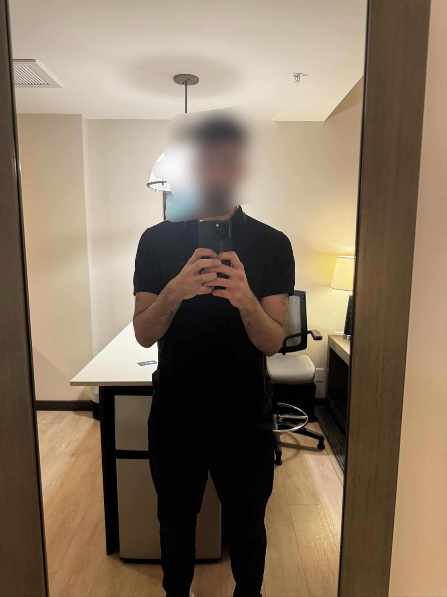
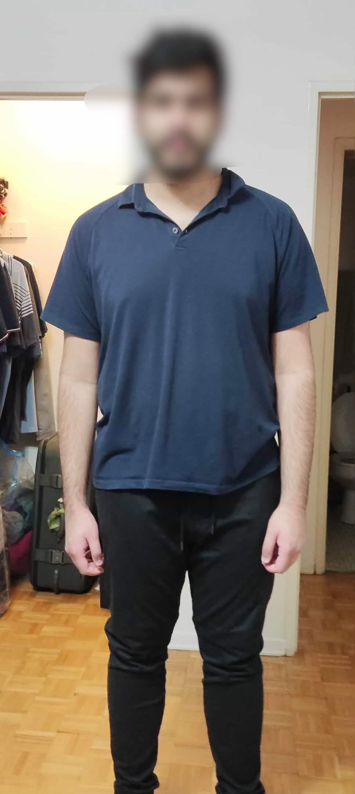

# The Syed Ashemi - Coaching Website

## Setup

### Clone & Run

```bash
git clone https://github.com/YOUR_USERNAME/thesyedashemi.git
cd thesyedashemi
```

**Mac/Linux:**
```bash
python3 -m http.server 8080
```

**Windows:**
```bash
python -m http.server 8080
```

Open **http://localhost:8080** in your browser.

### Deploy

Push to any static host: GitHub Pages, Netlify, Vercel, or Cloudflare Pages.

---

## Google Sheets (Form Submissions)

1. Create a Google Spreadsheet with headers in row 1:
   `Timestamp | Name | Email | Instagram | Phone | Fitness Level | Goal | Message`
2. Go to **Extensions > Apps Script**, paste contents of `google-apps-script.js`
3. **Deploy > New deployment** > Web app > Execute as: Me > Access: Anyone
4. Copy the URL and paste it in `script.js` on this line:

```js
const GOOGLE_SHEETS_URL = 'YOUR_GOOGLE_APPS_SCRIPT_URL_HERE';
```

5. Test it by submitting the form on your site — check the Google Sheet for a new row

---

## Before Making Any Changes

1. Make a new branch:
```bash
git branch your-branch-name
```
2. Go into that branch:
```bash
git checkout your-branch-name
```
3. Make your changes to the code
4. Stage and commit:
```bash
git add .
git commit -m "describe what you changed"
```
5. Push the branch to GitHub:
```bash
git push origin your-branch-name
```
6. Go to GitHub and create a **Pull Request** to merge into `master`
7. Review it, then click **Merge**

---

## Adding Your Video

### Option 1: Local MP4 file (recommended)

1. Drop your video file into the project folder (e.g. `video/intro.mp4`)
2. Open `index.html` and search for `id="video-placeholder"`
3. Replace everything inside that div with:

```html
<div class="aspect-video" id="video-placeholder">
    <video class="w-full h-full object-cover" controls playsinline>
        <source src="video/intro.mp4" type="video/mp4">
    </video>
</div>
```

### Option 2: YouTube embed

1. Copy the video ID from the URL (the part after `v=`)
2. Open `index.html` and search for `id="video-placeholder"`
3. Replace everything inside that div with:

```html
<div class="aspect-video" id="video-placeholder">
    <iframe
        src="https://www.youtube.com/embed/YOUR_VIDEO_ID"
        class="w-full h-full"
        frameborder="0"
        allowfullscreen>
    </iframe>
</div>
```

---

## Adding / Removing Transformation Clients

All client images go in `images/transformations/`. Name them `ClientX_Before.jpg` and `ClientX_After.jpg`.

### Add a new client

Copy an existing slide block in `index.html` (search for `<!-- Slide`) and update:

```html
<div class="swiper-slide">
    <div class="bg-matte-card border border-gold-500/20 rounded-lg overflow-hidden">
        <div class="relative">
            <div class="transformation-slider aspect-[4/5] relative overflow-hidden">
                <div class="slider-container swiper-no-swiping relative w-full h-full">
                    <!-- Base image (right side) -->
                    
                    <!-- Overlay image (left side) -->
                    <div class="slider-after absolute inset-0" style="clip-path: inset(0 50% 0 0);">
                        
                    </div>
                    <div class="slider-handle absolute top-0 bottom-0 w-1 bg-gold-500 cursor-ew-resize" style="left: 50%;">
                        <div class="absolute top-1/2 left-1/2 transform -translate-x-1/2 -translate-y-1/2 w-10 h-10 bg-gold-500 rounded-full flex items-center justify-center shadow-lg">
                            <svg class="w-6 h-6 text-black" fill="none" stroke="currentColor" viewBox="0 0 24 24"><path stroke-linecap="round" stroke-linejoin="round" stroke-width="2" d="M8 9l4-4 4 4m0 6l-4 4-4-4"></path></svg>
                        </div>
                    </div>
                </div>
            </div>
            <div class="absolute top-4 left-4 bg-matte-dark/90 px-3 py-1 rounded text-sm font-semibold">BEFORE</div>
            <div class="absolute top-4 right-4 bg-gold-500 px-3 py-1 rounded text-sm font-semibold text-black">AFTER</div>
        </div>
        <div class="p-4 text-center">
            <div class="text-gold-500 text-lg mb-2">★★★★★</div>
            <p class="text-gold-500 font-semibold">X Week Transformation</p>
        </div>
    </div>
</div>
```

Change the image paths and week count.

### Remove a client

Delete the entire `<div class="swiper-slide">...</div>` block for that client.

---

## Saving & Pushing Changes

After making any changes:

1. Open your terminal and `cd` into the project folder
2. Check what you changed:
```bash
git status
```
3. Stage your changes:
```bash
git add .
```
4. Commit with a short message describing what you did:
```bash
git commit -m "added new client transformation"
```
5. Push to GitHub:
```bash
git push -u origin redesignV1
```

---

## File Structure

```
thesyedashemi/
├── index.html              # Main page
├── styles.css              # Styles
├── script.js               # JS (form, sliders)
├── google-apps-script.js   # Google Sheets script
├── README.md               # This file
└── images/transformations/ # Client photos
```
